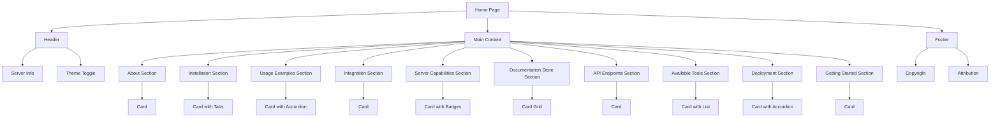

# Design Document: Home Page Refinement with shadcn-svelte Components

## Overview

This design document outlines the approach for refining the home page of the shadcn-svelte MCP server by implementing shadcn-svelte UI components and adding dark theme support. The refined home page will provide a more polished, accessible, and visually appealing interface that showcases the capabilities of shadcn-svelte components while maintaining all existing functionality.

## Architecture

The implementation will follow the existing SvelteKit architecture, with enhancements to incorporate shadcn-svelte components and dark theme support. The current home page will be refactored to use shadcn-svelte components while maintaining the same content structure and functionality.

### Component Architecture

The home page will be structured using the following shadcn-svelte components:

1. **Layout Components**
   - `Card` - For content sections
   - `Separator` - For visual separation between sections
   - `Tabs` - For organizing installation guides and examples

2. **Interactive Components**
   - `Button` - For interactive elements
   - `ThemeToggle` - For switching between light and dark themes

3. **Display Components**
   - `Badge` - For tags and labels
   - `Accordion` - For expandable content sections
   - `Code` - For code examples with syntax highlighting

4. **Theme Management**
   - `ModeWatcher` - For detecting and applying theme preferences

### Dark Theme Implementation

The dark theme implementation will leverage the existing CSS variables in `app.css`, which already includes dark mode support. We'll use the existing ThemeToggle component and the mode-watcher package to switch between themes and persist the user's preference.

## Components and Interfaces

### Theme Toggle Component

We'll use the existing `ThemeToggle` component located at `src/lib/components/blocks/ThemeToggle.svelte`:

```svelte
<script lang="ts">
	import SunIcon from '@lucide/svelte/icons/sun';
	import MoonIcon from '@lucide/svelte/icons/moon';

	import { toggleMode } from 'mode-watcher';
	import { Button } from '$lib/components/ui/button/index.js';
</script>

<Button onclick={toggleMode} variant="outline" size="icon">
	<SunIcon
		class="h-[1.2rem] w-[1.2rem] scale-100 rotate-0 !transition-all dark:scale-0 dark:-rotate-90"
	/>
	<MoonIcon
		class="absolute h-[1.2rem] w-[1.2rem] scale-0 rotate-90 !transition-all dark:scale-100 dark:rotate-0"
	/>
	<span class="sr-only">Toggle theme</span>
</Button>
```

This component uses the `mode-watcher` package to handle theme toggling and persistence.

### Theme Initialization

The theme initialization is already handled by the existing setup with the mode-watcher package, which manages theme detection, switching, and persistence.

### Card Component Usage

Content sections will be wrapped in Card components:

```svelte
<Card.Root>
	<Card.Header>
		<Card.Title>Section Title</Card.Title>
		<Card.Description>Section description</Card.Description>
	</Card.Header>
	<Card.Content>
		<!-- Section content -->
	</Card.Content>
	<Card.Footer>
		<!-- Footer content if needed -->
	</Card.Footer>
</Card.Root>
```

### Tabs Component Usage

Installation guides and examples will be organized using Tabs:

```svelte
<Tabs.Root value="sveltekit">
	<Tabs.List>
		<Tabs.Trigger value="sveltekit">SvelteKit</Tabs.Trigger>
		<Tabs.Trigger value="vite">Vite</Tabs.Trigger>
		<Tabs.Trigger value="astro">Astro</Tabs.Trigger>
	</Tabs.List>
	<Tabs.Content value="sveltekit">
		<!-- SvelteKit installation guide -->
	</Tabs.Content>
	<Tabs.Content value="vite">
		<!-- Vite installation guide -->
	</Tabs.Content>
	<Tabs.Content value="astro">
		<!-- Astro installation guide -->
	</Tabs.Content>
</Tabs.Root>
```

### Accordion Component Usage

Expandable content sections will use Accordion:

```svelte
<Accordion.Root type="single" collapsible>
	<Accordion.Item value="item-1">
		<Accordion.Trigger>Section Title</Accordion.Trigger>
		<Accordion.Content>
			<!-- Section content -->
		</Accordion.Content>
	</Accordion.Item>
</Accordion.Root>
```

### Badge Component Usage

Tags and labels will use Badge:

```svelte
<Badge variant="outline">{tag}</Badge>
```

## Data Models

The implementation will use the existing data models from the current home page:

```typescript
// Server information
const serverInfo = mcpServer.getServerInfo();

// Documentation store statistics
const stats = documentationStore.getStats();

// Components and categories
const components = documentationStore.getAllComponents();
const categories = documentationStore.getAllCategories();

// Installation guides
const installationGuides = documentationStore.getAllInstallationGuides();
```

## Code Block Syntax Highlighting

For code examples, we'll implement syntax highlighting using the shadcn-svelte approach:

```svelte
<pre class="bg-muted rounded-md p-4">
  <code class="text-foreground text-sm">
    {codeExample}
  </code>
</pre>
```

## Layout and Visual Hierarchy

The layout will be improved with a clear visual hierarchy:

1. **Header** - Server name, description, and theme toggle
2. **Main Content** - Organized into cards with consistent spacing
3. **Footer** - Copyright and attribution information

The layout will use a responsive grid system to ensure proper display on various screen sizes:

```svelte
<div class="container mx-auto px-4 py-8">
	<header class="mb-8 flex items-center justify-between">
		<!-- Header content -->
	</header>

	<main class="grid grid-cols-1 gap-6 md:grid-cols-2">
		<!-- Main content -->
	</main>

	<footer class="border-border text-muted-foreground mt-12 border-t pt-8 text-center text-sm">
		<!-- Footer content -->
	</footer>
</div>
```

## Error Handling

Error handling will be implemented for theme switching to ensure a smooth user experience. The mode-watcher package handles most of the error cases, but we'll add additional error handling where needed.

## Testing Strategy

The implementation will be tested to ensure:

1. **Visual Consistency** - Components render correctly in both light and dark themes
2. **Functionality** - Theme toggle works as expected
3. **Responsiveness** - Layout adapts to different screen sizes
4. **Accessibility** - Components meet accessibility standards

## Diagrams

### Component Structure



### Theme Switching Flow

```mermaid
flowchart TD
    A[Page Load] --> B[ModeWatcher Initializes]
    B --> C[Check localStorage]
    C -->|Theme Found| D[Apply Stored Theme]
    C -->|No Theme| E[Check System Preference]
    E -->|Dark Preferred| F[Apply Dark Theme]
    E -->|Light Preferred| G[Apply Light Theme]

    H[Theme Toggle Clicked] --> I[toggleMode() Called]
    I --> J[Update Theme]
    J --> K[Update localStorage]
    K --> L[Update UI]
```

## Implementation Plan

1. **Install Required shadcn-svelte Components**
   - Install Button component: `bun x shadcn-svelte@latest add button`
   - Install Card component: `bun x shadcn-svelte@latest add card`
   - Install Tabs component: `bun x shadcn-svelte@latest add tabs`
   - Install Accordion component: `bun x shadcn-svelte@latest add accordion`
   - Install Badge component: `bun x shadcn-svelte@latest add badge`
   - Install Separator component: `bun x shadcn-svelte@latest add separator`

2. **Set Up Theme Components**
   - Add ModeWatcher component to the page
   - Add ThemeToggle component to the header

3. **Refactor Header**
   - Replace existing header with shadcn-svelte components
   - Add theme toggle

4. **Refactor Content Sections**
   - Replace each section with appropriate shadcn-svelte components
   - Implement Cards, Tabs, Accordions, and Badges

5. **Implement Code Block Syntax Highlighting**
   - Add syntax highlighting for code examples

6. **Refine Layout and Visual Hierarchy**
   - Improve spacing and alignment
   - Enhance responsive design

7. **Test and Refine**
   - Test in both light and dark themes
   - Test on various screen sizes
   - Ensure accessibility compliance

## Conclusion

This design provides a comprehensive approach to refining the home page with shadcn-svelte components and dark theme support. By following this design, we can create a more polished, accessible, and visually appealing interface that showcases the capabilities of shadcn-svelte components while maintaining all existing functionality.
