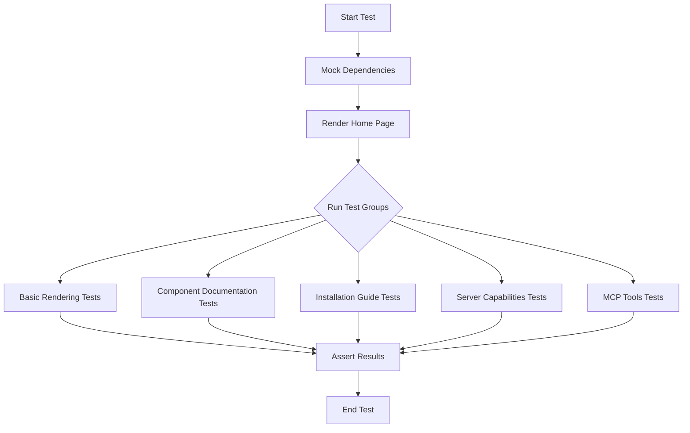
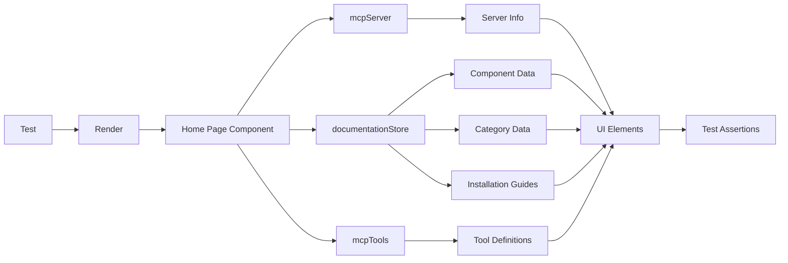

# Design Document: Home Page Testing

## Overview

This design document outlines the approach for implementing comprehensive tests for the home page of the shadcn-svelte MCP server using testing-library/svelte with Svelte 5 syntax. The tests will verify that the home page renders correctly, displays the expected content, and maintains proper functionality.

## Architecture

The testing architecture will follow the recommended practices for testing Svelte components with testing-library/svelte, adapted for Svelte 5's runes syntax. The tests will be organized into logical groups that align with the requirements, focusing on different aspects of the home page.

### Testing Stack

- **Test Runner**: Vitest
- **Testing Library**: @testing-library/svelte
- **DOM Environment**: jsdom
- **Assertion Library**: Vitest's built-in assertions + @testing-library/jest-dom

### File Structure

```
src/
└── routes/
    └── +page.svelte           # Home page component
    └── page.svelte.test.ts    # Home page tests
```

## Components and Interfaces

### Test Subjects

The main component to be tested is the home page component located at `src/routes/+page.svelte`. This component displays:

1. Server information (name, description, version)
2. Documentation sections (About, Installation, Usage Examples, etc.)
3. Component documentation (list, categories, statistics)
4. Installation guides
5. Server capabilities
6. Available MCP tools

### Test Utilities

We will create the following test utilities:

1. **Setup Function**: Configures the test environment and renders the home page component
2. **Query Helpers**: Functions to help query specific elements on the page
3. **Mock Data**: Mock implementations of the MCP server and documentation store

## Data Models

### Mock Data Structure

```typescript
// Mock MCP Server
const mockMcpServer = {
	getServerInfo: () => ({
		name: 'shadcn-svelte MCP Server',
		description: 'MCP server for shadcn-svelte component documentation',
		version: '1.0.0',
		capabilities: ['component-info', 'examples', 'search']
	})
};

// Mock Documentation Store
const mockDocumentationStore = {
	getStats: () => ({
		totalComponents: 10,
		totalCategories: 3,
		totalInstallationGuides: 2,
		componentsWithExamples: 8,
		componentsWithTroubleshooting: 5
	}),
	getAllComponents: () => [
		{ name: 'Button', category: 'ui' },
		{ name: 'Card', category: 'ui' }
		// ...more components
	],
	getAllCategories: () => [
		{ name: 'ui', components: ['Button', 'Card'] },
		{ name: 'form', components: ['Input', 'Checkbox'] },
		{ name: 'layout', components: ['Container', 'Grid'] }
	],
	getAllInstallationGuides: () => [
		{ framework: 'sveltekit', requirements: ['Node.js 18+'], steps: [] },
		{ framework: 'vite', requirements: ['Node.js 18+'], steps: [] }
	],
	getComponentsByCategory: (category) => {
		// Return components for the given category
	},
	getInstallationGuide: (framework) => {
		// Return installation guide for the given framework
	}
};

// Mock MCP Tools
const mockMcpTools = [
	{ name: 'getComponentInfo', description: 'Get information about a component' },
	{ name: 'getComponentExample', description: 'Get examples for a component' },
	{ name: 'searchComponents', description: 'Search for components' }
];
```

## Testing Strategy

### 1. Module Mocking

We will use Vitest's mocking capabilities to mock the imported modules:

```typescript
// Mock the imported modules
vi.mock('$lib/mcp/core/init', () => ({
	mcpServer: mockMcpServer
}));

vi.mock('$lib/mcp/core/documentation-store', () => ({
	documentationStore: mockDocumentationStore
}));

vi.mock('$lib/mcp/tools', () => ({
	mcpTools: mockMcpTools
}));
```

### 2. Component Rendering

We will use testing-library/svelte's `render` function to render the home page component:

```typescript
import { render, screen } from '@testing-library/svelte';
import HomePage from './+page.svelte';

describe('+page.svelte', () => {
	beforeEach(() => {
		render(HomePage);
	});

	// Tests go here
});
```

### 3. Element Queries

We will use testing-library's query functions to find elements on the page:

```typescript
test('displays server information', () => {
	expect(screen.getByText('shadcn-svelte MCP Server')).toBeInTheDocument();
	expect(
		screen.getByText('MCP server for shadcn-svelte component documentation')
	).toBeInTheDocument();
	expect(screen.getByText(/Version: 1\.0\.0/)).toBeInTheDocument();
});
```

### 4. Test Organization

Tests will be organized into logical groups that align with the requirements:

1. **Basic Rendering Tests**: Verify that the page renders with the correct title, description, and version
2. **Component Documentation Tests**: Verify that component information is displayed correctly
3. **Installation Guide Tests**: Verify that installation guides are displayed correctly
4. **Server Capabilities Tests**: Verify that server capabilities are displayed correctly
5. **MCP Tools Tests**: Verify that MCP tools are displayed correctly

## Error Handling

The tests will include error handling scenarios:

1. **Missing Data**: Tests for how the UI handles missing or undefined data
2. **Empty Lists**: Tests for how the UI handles empty component lists or categories
3. **Error States**: Tests for how the UI handles error states (if applicable)

## Testing Svelte 5 Runes

To properly test components using Svelte 5 runes, we need to ensure that:

1. The testing library is compatible with Svelte 5
2. Reactivity is properly tested
3. State changes are correctly reflected in the UI

Based on research, the latest version of @testing-library/svelte (5.x+) supports Svelte 5 runes out of the box. We'll use the `svelteTesting` plugin in the Vite configuration to ensure proper setup.

```typescript
// vite.config.js
import { defineConfig } from 'vitest/config';
import { sveltekit } from '@sveltejs/kit/vite';
import { svelteTesting } from '@testing-library/svelte/vite';

export default defineConfig({
	plugins: [sveltekit(), svelteTesting()],
	test: {
		environment: 'jsdom',
		setupFiles: ['./vitest-setup.js']
	}
});
```

## Diagrams

### Test Flow Diagram



### Component Interaction Diagram



## Conclusion

This design provides a comprehensive approach to testing the home page of the shadcn-svelte MCP server using testing-library/svelte with Svelte 5 syntax. By following this design, we can ensure that the home page renders correctly, displays the expected content, and maintains proper functionality as the application evolves.
