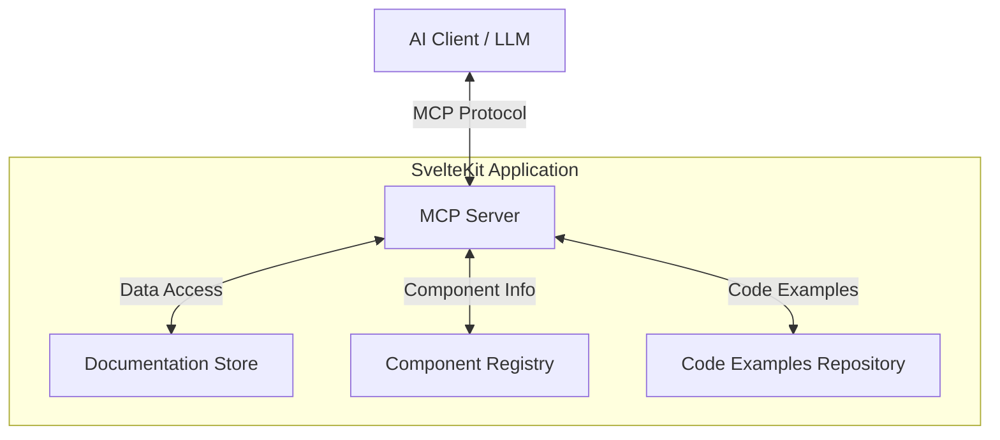

# Design Document: shadcn-svelte MCP Server

## Overview

The shadcn-svelte MCP (Model Context Protocol) server is designed to provide AI assistants and language models with structured access to shadcn-svelte component documentation. This server will be built as a SvelteKit application that implements the MCP specification, allowing AI systems to query and retrieve information about shadcn-svelte components, their usage, configuration options, and examples.

The server will act as a bridge between AI systems and the shadcn-svelte documentation, enabling natural language queries about components and returning structured, relevant information that can be used by AI assistants to help developers implement shadcn-svelte in their projects.

## Architecture

The architecture of the shadcn-svelte MCP server consists of several key components:

### High-Level Architecture



### Core Components

1. **MCP Server Core**: Implements the Model Context Protocol specification, handling requests from AI clients and returning appropriate responses.

2. **Documentation Store**: A structured repository of shadcn-svelte documentation, organized by component and topic.

3. **Component Registry**: A registry of all available shadcn-svelte components, their properties, and relationships.

4. **Code Examples Repository**: A collection of code examples for each component, showing various usage patterns and configurations.

5. **Query Processor**: Processes structured queries from AI clients and maps them to relevant documentation and examples. Since MCP uses a structured protocol with defined tools and parameters, we won't need an additional AI model to interpret requests - the AI client will format requests according to our tool specifications.

6. **Response Formatter**: Formats responses according to the MCP specification, ensuring they are properly structured for consumption by AI clients.

### Data Flow

1. An AI client sends a request to the MCP server using the MCP protocol.
2. The server processes the request, extracting key information such as the component name, specific questions, or requested examples.
3. The query processor maps the request to relevant documentation in the documentation store.
4. The server retrieves the requested information, including component details, usage examples, and related information.
5. The response formatter structures the information according to the MCP specification.
6. The server sends the formatted response back to the AI client.

## Components and Interfaces

### MCP Server Interface

The MCP server will implement the standard MCP interface, which includes:

1. **Tool Discovery**: Allows clients to discover available tools and capabilities.
2. **Resource Access**: Provides access to documentation resources.
3. **Tool Execution**: Executes specific tools, such as searching for components or retrieving examples.

### MCP Tools

The server will provide the following MCP tools:

1. **`getComponentInfo`**: Retrieves general information about a specific component.
   - Parameters: `componentName` (string)
   - Returns: Component description, usage information, and available props.

2. **`getComponentExample`**: Retrieves code examples for a specific component.
   - Parameters: `componentName` (string), `exampleType` (string, optional)
   - Returns: Code examples with explanations.

3. **`searchComponents`**: Searches for components based on keywords or functionality.
   - Parameters: `query` (string)
   - Returns: List of matching components with brief descriptions.

4. **`getThemingInfo`**: Retrieves information about theming and customizing components.
   - Parameters: `componentName` (string, optional)
   - Returns: Theming guidance, CSS variables, and customization options.

5. **`getTroubleshooting`**: Retrieves troubleshooting information for common issues.
   - Parameters: `componentName` (string), `issue` (string, optional)
   - Returns: Troubleshooting steps and solutions.

### MCP Resources

The server will provide the following MCP resources:

1. **Component Documentation**: Full documentation for each component.
2. **Installation Guides**: Documentation on installing and setting up shadcn-svelte.
3. **Theming Documentation**: Documentation on theming and customizing components.
4. **Framework Integration**: Documentation on integrating with different frameworks (SvelteKit, Vite, Astro).

## Data Models

### Component Model

```typescript
interface Component {
  name: string;
  description: string;
  usage: string;
  props: Prop[];
  examples: Example[];
  relatedComponents: string[];
  cssVariables: CSSVariable[];
  troubleshooting: TroubleshootingItem[];
}

interface Prop {
  name: string;
  type: string;
  description: string;
  default?: string;
  required: boolean;
}

interface Example {
  title: string;
  description: string;
  code: string;
  type: string; // "basic", "advanced", "theming", etc.
}

interface CSSVariable {
  name: string;
  description: string;
  default: string;
}

interface TroubleshootingItem {
  issue: string;
  solution: string;
  relatedProps?: string[];
}
```

### Query Model

```typescript
interface ComponentQuery {
  componentName?: string;
  topic?: string; // "usage", "props", "examples", "theming", "troubleshooting"
  specificQuestion?: string;
  exampleType?: string;
  framework?: string; // "sveltekit", "vite", "astro"
}
```

### Response Model

```typescript
interface ComponentResponse {
  componentName: string;
  topic: string;
  content: string;
  examples?: Example[];
  relatedComponents?: string[];
  additionalResources?: string[];
}
```

## Error Handling

The server will implement comprehensive error handling to ensure robustness and provide meaningful feedback to clients:

1. **Component Not Found**: When a requested component doesn't exist, return a helpful message with suggestions for similar components.

2. **Invalid Query**: When a query cannot be processed, return an explanation of the issue and guidance on how to form a valid query.

3. **Server Errors**: Log internal server errors and return a generic error message to the client to avoid exposing sensitive information.

4. **Rate Limiting**: Implement rate limiting to prevent abuse and ensure fair usage of the server resources.

## Testing Strategy

The testing strategy for the shadcn-svelte MCP server includes:

1. **Unit Tests**: Test individual components and functions to ensure they work as expected.

2. **Integration Tests**: Test the interaction between different components of the system.

3. **End-to-End Tests**: Test the complete flow from client request to server response.

4. **Performance Tests**: Ensure the server can handle a reasonable load and responds within acceptable time limits.

5. **Compatibility Tests**: Ensure the server works with different AI clients and adheres to the MCP specification.

## SvelteKit Integration

The MCP server will be integrated into a SvelteKit application, primarily focusing on server-side functionality with a single homepage for documentation:

1. **Server Structure**: Implement the core MCP functionality in server.ts files rather than page.server.ts files, focusing on a clean server-based architecture.

2. **API Routes**: Implement MCP endpoints as SvelteKit API routes using server.ts files.

3. **Homepage**: Create a single page.svelte for the homepage that displays project details, documentation, and installation instructions.

4. **Environment Configuration**: Use SvelteKit's environment configuration for server settings.

5. **Deployment**: Leverage SvelteKit's deployment options for easy deployment to various platforms.

## Documentation Synchronization

To ensure the MCP server provides up-to-date information about shadcn-svelte components, we will implement a documentation synchronization strategy:

1. **Initial Data Loading**: Load component documentation from static files during server initialization.

2. **Update Mechanism**: Provide a mechanism to update the documentation when new versions of shadcn-svelte are released.

3. **Version Tracking**: Track the version of shadcn-svelte documentation being served to ensure consistency.

## Security Considerations

The MCP server will implement security measures to protect against common vulnerabilities:

1. **Input Validation**: Validate all input from clients to prevent injection attacks.

2. **Rate Limiting**: Implement rate limiting to prevent denial-of-service attacks.

3. **Authentication**: Optionally support authentication for private deployments.

4. **CORS Configuration**: Configure Cross-Origin Resource Sharing (CORS) to control which domains can access the server.

## Deployment Considerations

The MCP server will be designed for easy deployment to various environments:

1. **Local Development**: Support local development with minimal setup.

2. **Serverless Deployment**: Support deployment to serverless platforms like Vercel, Netlify, or AWS Lambda.

3. **Container Deployment**: Support deployment as a Docker container for more traditional hosting environments.

4. **Environment Variables**: Use environment variables for configuration to support different deployment environments.

## Future Enhancements

Potential future enhancements for the shadcn-svelte MCP server include:

1. **Interactive Examples**: Provide interactive examples that can be modified and previewed.

2. **Component Playground**: Create a playground where users can experiment with components and see the results.

3. **Custom Component Support**: Allow users to add their own custom components to the documentation.

4. **Analytics**: Add analytics to track which components and features are most commonly queried.

5. **Multi-Version Support**: Support multiple versions of shadcn-svelte documentation.

## Conclusion

The shadcn-svelte MCP server design provides a robust foundation for creating a bridge between AI assistants and shadcn-svelte documentation. By implementing the MCP specification and organizing shadcn-svelte documentation in a structured way, the server will enable AI systems to provide accurate and helpful information about shadcn-svelte components to developers.