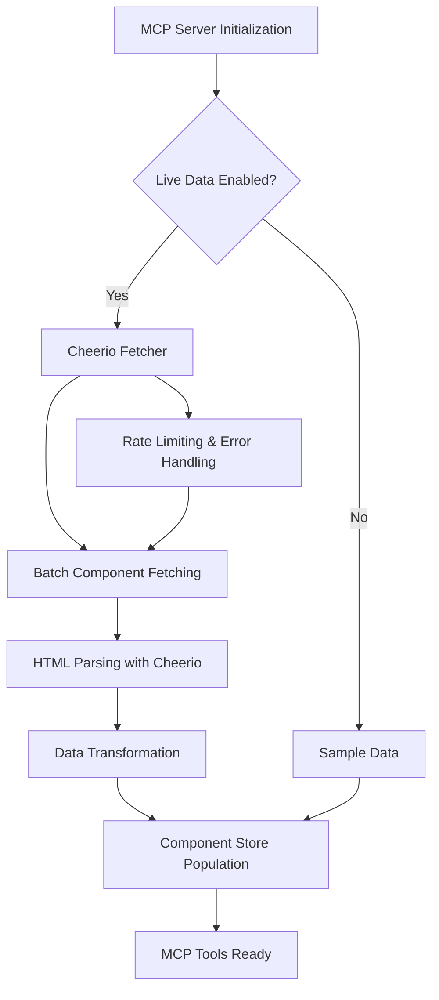
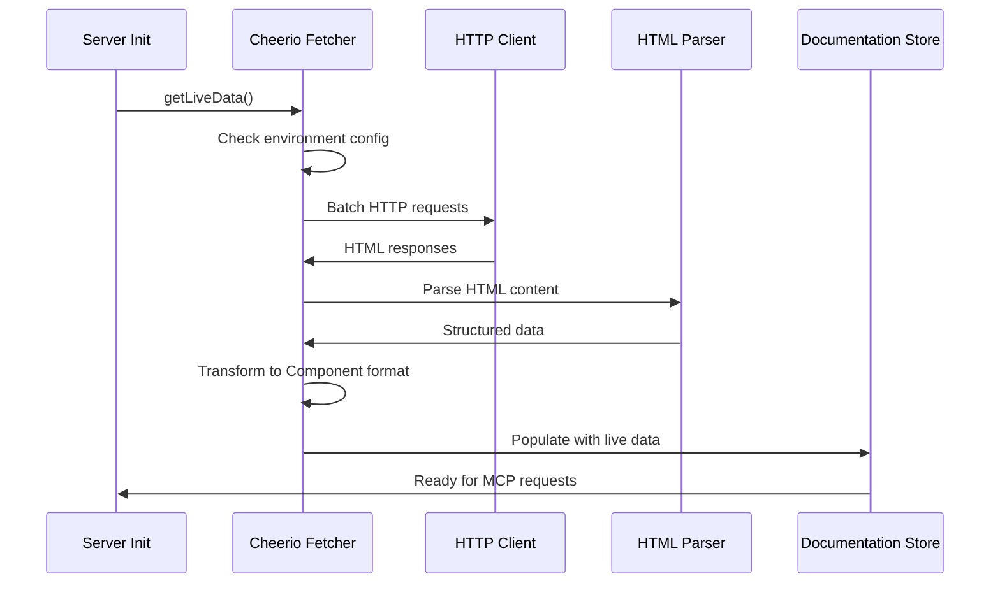
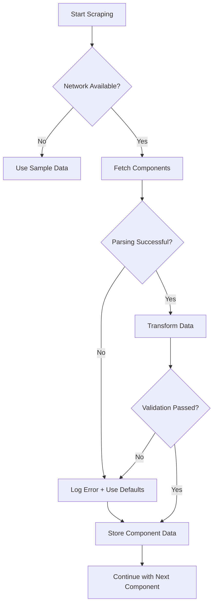

# Design Document

## Overview

The web scraper integration adds real-time data fetching capabilities to the shadcn-svelte MCP server by implementing a Cheerio and Axios-based scraping system. This design replaces the current hardcoded sample data with live component documentation from the official shadcn-svelte website, providing comprehensive and up-to-date information for all 47+ available components.

## Architecture

### High-Level Architecture



### Component Interaction Flow



## Components and Interfaces

### Core Components

#### 1. CheerioFetcher (`cheerio-fetcher.ts`)

**Purpose:** Main scraping orchestrator that coordinates HTTP requests and HTML parsing.

**Key Functions:**

- `fetchAllComponentsWithCheerio()`: Orchestrates fetching all components
- `fetchComponentWithCheerio(componentName)`: Fetches individual component data
- `shouldFetchLiveData()`: Determines if live fetching should be enabled

**Dependencies:**

- Axios for HTTP requests
- Cheerio for HTML parsing
- Component type definitions

#### 2. HTMLParser

**Purpose:** Extracts structured data from HTML using Cheerio selectors.

**Key Functions:**

- `extractDescription($, componentName)`: Extracts component descriptions
- `extractExamples($)`: Parses code examples from HTML
- `extractInstallCommand($, componentName)`: Gets installation commands
- `extractImportStatement($, componentName)`: Extracts import syntax

#### 3. DataTransformer

**Purpose:** Converts scraped data into the existing Component interface format.

**Key Functions:**

- `parseComponentName(kebabName)`: Converts kebab-case to PascalCase
- `inferCategory(componentName)`: Categorizes components by functionality
- `formatExamples(rawExamples)`: Structures examples with proper typing

#### 4. ConfigurationManager

**Purpose:** Manages environment-based configuration for scraping behavior.

**Configuration Options:**

- `USE_LIVE_SHADCN_DATA`: Enable/disable live data fetching
- `SCRAPER_BATCH_SIZE`: Number of components to fetch simultaneously
- `SCRAPER_DELAY_MS`: Delay between batch requests
- `SCRAPER_TIMEOUT_MS`: HTTP request timeout

### Data Models

#### ScrapingConfig Interface

```typescript
interface ScrapingConfig {
	enabled: boolean;
	batchSize: number;
	delayBetweenBatches: number;
	requestTimeout: number;
	userAgent: string;
	maxRetries: number;
}
```

#### ComponentParsingResult Interface

```typescript
interface ComponentParsingResult {
	success: boolean;
	component?: Component;
	error?: string;
	url: string;
	processingTime: number;
}
```

## Error Handling

### Error Categories and Responses

#### 1. Network Errors

- **HTTP 404/500 errors**: Log warning, skip component, continue with others
- **Timeout errors**: Retry up to 3 times with exponential backoff
- **Connection errors**: Fall back to sample data with detailed logging

#### 2. Parsing Errors

- **Invalid HTML structure**: Use fallback parsing strategies
- **Missing elements**: Provide default values and log warnings
- **Malformed code examples**: Skip invalid examples, keep valid ones

#### 3. Configuration Errors

- **Invalid environment variables**: Use safe defaults
- **Missing dependencies**: Fail gracefully with clear error messages

### Fallback Strategy



## Testing Strategy

### Unit Testing Approach

#### 1. Fetcher Module Tests

- Mock Axios responses with real HTML samples
- Test error handling for various HTTP status codes
- Verify rate limiting and batch processing logic
- Test configuration loading and validation

#### 2. Parser Module Tests

- Test HTML parsing with known component page structures
- Verify extraction of descriptions, examples, and commands
- Test edge cases like missing elements or malformed HTML
- Validate data transformation accuracy

#### 3. Integration Tests

- Test complete scraping workflow with mock HTTP server
- Verify fallback to sample data when scraping fails
- Test MCP tool integration with scraped data
- Performance testing with large component sets

### Test Data Strategy

- Capture real HTML samples from shadcn-svelte.com for consistent testing
- Create mock responses for various error scenarios
- Maintain test fixtures for component data validation

## Performance Considerations

### Optimization Strategies

#### 1. Batch Processing

- Process components in batches of 3-5 to balance speed and server load
- Implement configurable delays between batches (default: 2 seconds)
- Use Promise.allSettled() to handle individual component failures gracefully

#### 2. Caching Strategy

- Cache successful component data in memory during server runtime
- Implement optional file-based caching for development environments
- Use ETags or Last-Modified headers when available

#### 3. Resource Management

- Set reasonable timeouts for HTTP requests (10 seconds)
- Limit concurrent connections to respect server resources
- Implement circuit breaker pattern for repeated failures

### Performance Metrics

- Track scraping duration and success rates
- Monitor memory usage during batch processing
- Log component parsing times for optimization insights

## Security Considerations

### Web Scraping Ethics

- Respect robots.txt guidelines (though shadcn-svelte.com allows scraping)
- Use appropriate User-Agent headers identifying the MCP server
- Implement rate limiting to avoid overwhelming the target server
- Handle HTTP 429 (Too Many Requests) responses appropriately

### Data Validation

- Sanitize extracted HTML content before processing
- Validate component data structure before storage
- Implement input validation for configuration parameters
- Use TypeScript strict mode for compile-time safety

## Deployment Considerations

### Environment Configuration

- Development: Disabled by default to avoid unnecessary requests
- Production: Enabled by default for live data
- Staging: Configurable via environment variables

### Monitoring and Logging

- Structured logging for scraping operations
- Error tracking and alerting for scraping failures
- Performance metrics collection
- Health checks for scraping functionality

### Rollback Strategy

- Always maintain sample data as fallback
- Graceful degradation when scraping is unavailable
- Configuration flags for quick disable/enable
- Version compatibility with existing MCP tools
